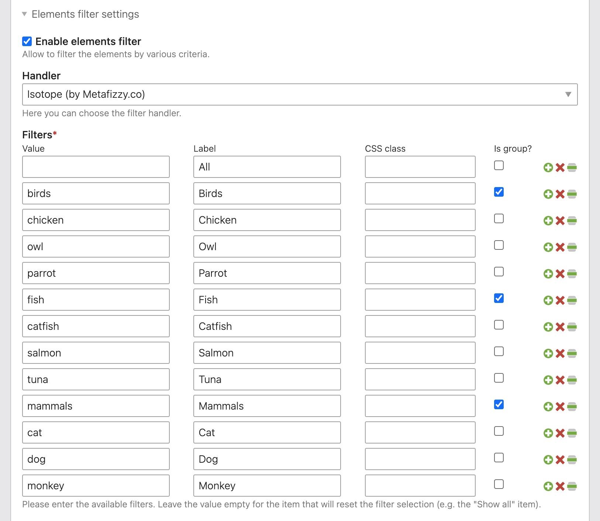

# Elements Filter extension for Contao Open Source CMS

Elements Filter is an extension for the [Contao Open Source CMS](https://contao.org).

Contao extension that allows to setup content element filtering using Javascript. The predefined
filters can be set up in the article settings and then the content elements inside that article
can be marked to be filtered by specific values.

The filtering is done using Javascript and there are two handles provided out of the box:

1. Default handler (simple fade in/out effect)
2. [Isotope](http://isotope.metafizzy.co/) by Metafizzy.co (may require a license)

## Documentation

1. [Installation](docs/01-installation.md)
2. [Basic configuration](docs/02-basics.md)

## Copyright

This project has been created and is maintained by [Codefog](https://codefog.pl).

Thanks to Kim Wormer form [heartcodiert](https://www.heartcodiert.de/) for sponsoring this extension!
