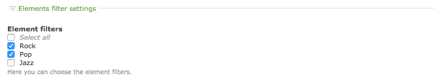

# Basic configuration – Elements Fitler

1. [Installation](01-installation.md)
2. [**Basic configuration**](02-basics.md)

## Enabling the filters

To enable the filters simply go to the article settings and check the appropriate box. Once the fields
appear you can choose the Javascript handler you would like to use for filtering and define the
available filters.

### Filters in details

The filter value is an internal ID for the filter. The allowed characters are only alphanumeric characters
and the dashes (this value will be used as CSS class). **Hint:** to create the "Show all" button do not
enter any value.

The label is a text value displayed on the filter button.

As an extra you can also enter the CSS class per each filter button and give it a special styling.

## Content element settings

Once you got the filters ready, you can start assign the content elements to appropriate filters.
A content element can belong to one or multiple filters. If the filters are not assigned at all
then the content element will not be filtered. 

