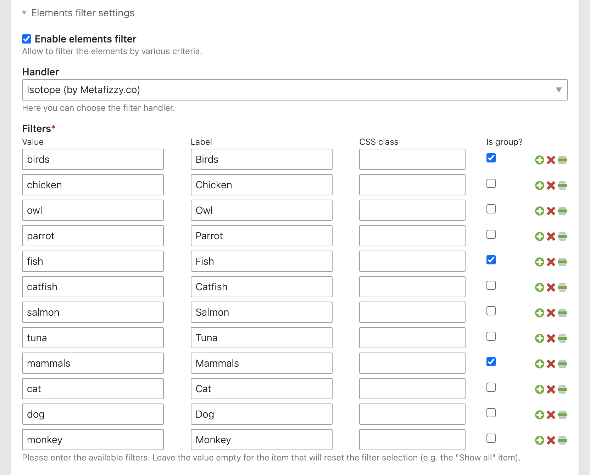

# Elements Filter – Documentation

The extension supports two types of filters:

1. The flat filters – all options are listed in a simple list.
2. The grouped filters – options can be grouped into nested lists.

Read more about them below.

## Flat filters

You can configure the element filters in the article settings, as shown in the image:

Then, for each content element inside the article, you can choose the filters as follows:

Here is an example of how it would look in the frontend:

## Grouped filters

You can configure the element filters in the article settings, as shown in the image:

Then, for each content element inside the article, you can choose the filters as follows:

Here is an example of how it would look in the frontend:

